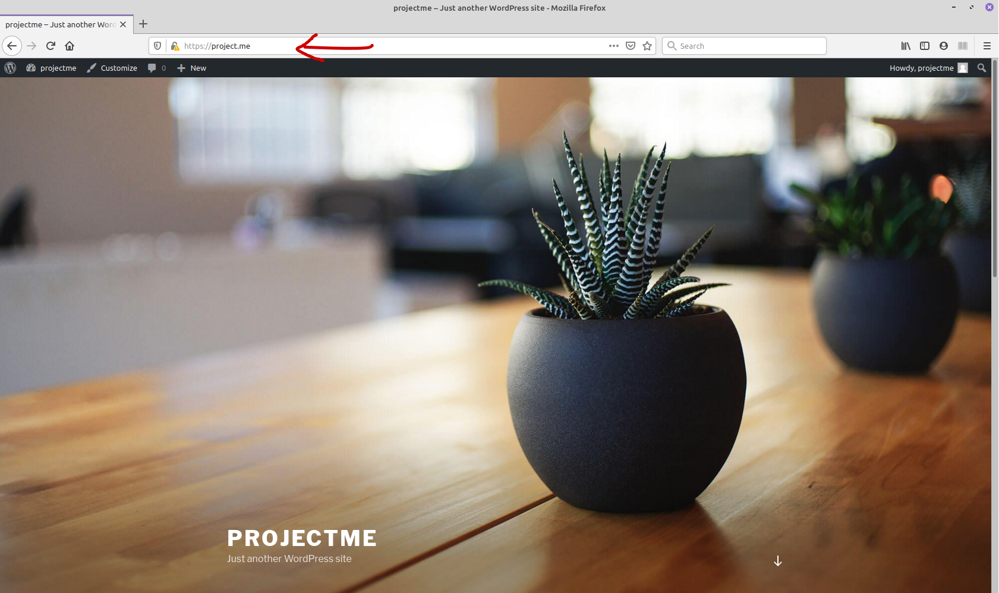
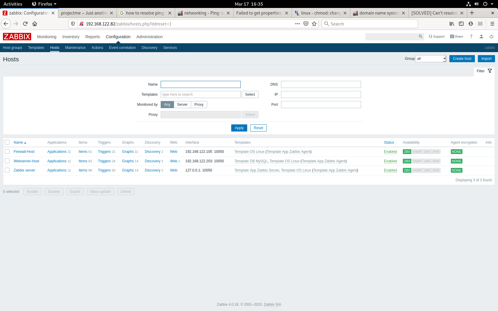
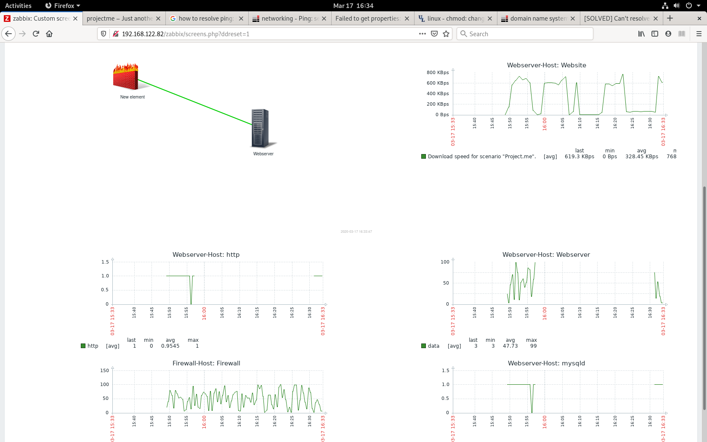

# The main purpose of this scenario is to work with to ansible.   

#### This scenario requires two hosts to implement.    
#### The first host is an Apache web server that provides the WordPress website includes all of the following:
```
- mariadb
- php
- httpd
- wordpress
- ssl certificat (self signed)
- iptables
```

#### The second host is a firewall listening to the outside world and sending all requests to the web server.  
***
## Monitoring of nodes    
   

> just type your hosts ip address in the variables files.
